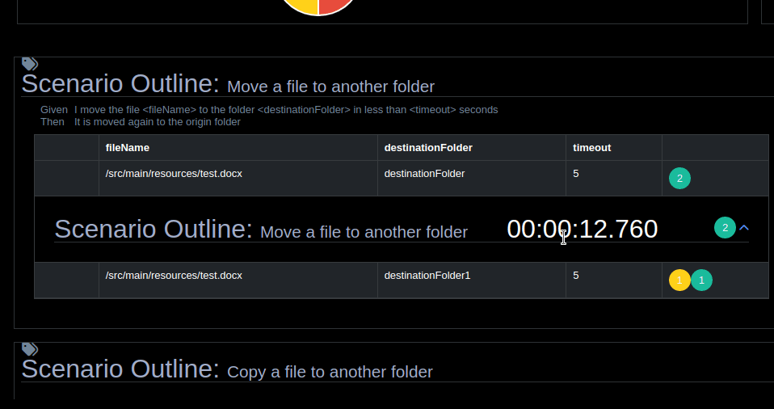
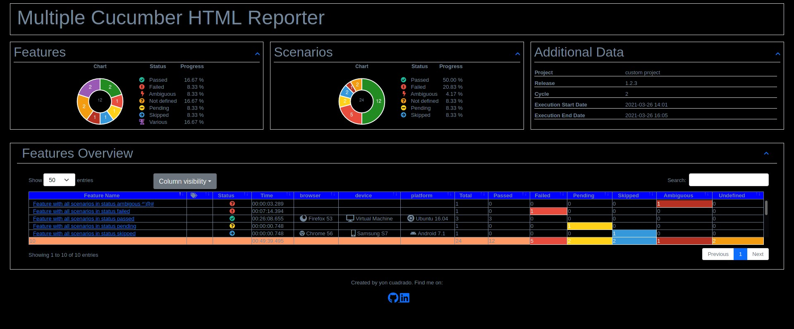
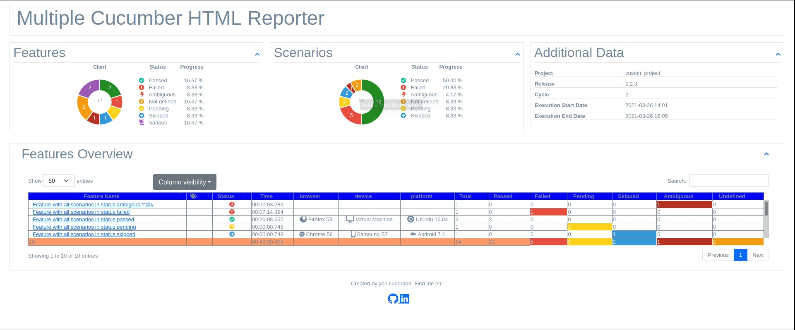

# wdio-cucumber-html-reporter
A WDIO reporter that creates an html report using the plugin [cucumber-html-report-generator](https://github.com/yon-cuadrado-projects/cucumber-html-report-generator). This plugin has been created from the project [multiple-cucumber-html-reporter](https://github.com/wswebcreation/multiple-cucumber-html-reporter). The main differences with that project are these:

- written with typescript
- option to display Outline scenarios in a grouped way

 
- Option to store the reports in a mongodb database and access them from a web page
- Dark and light themes





A sample with dark theme and report metadata can be found [here](./docs/report-with-dark-theme-and-report-metadata/index.html)
and a sample with light theme and report metadata can be found [here](./docs/report-with-light-theme-and-report-metadata/index.html)

And a sample with dark theme without report metadata can be found [here](./docs/report-with-dark-theme-without-report-metadata/index.html)
and a sample with light theme without report metadata can be found [here](./docs/report-with-light-theme-and-without-report-metadata/index.html)


[](http://opensource.org/licenses/MIT)

[](https://nodei.co/npm/wdio-cucumber-html-reporter/)

> **THIS MODULE CAN ONLY WORK WITH WebdriverIO V7+!**\

## What does it do
This reporter will generate an html file using the plugin

It will also add metadata about the running instance to the feature file and last but not least, it will give you the opportunity to add attachments to the JSON output.

## Installation
The easiest way is to keep `wdio-cucumber-html-reporter` as a devDependency in your `package.json`.

You can simple do it by:

```bash
npm install wdio-cucumber-html-reporter --save-dev
```

so it will automatically be added to your `package.json`

Instructions on how to install `WebdriverIO` can be found [here](http://webdriver.io/guide/getstarted/install.html).

## Configuration
This reporter first generates the json files with the results of the execution.
Configure the output directory and the language in your wdio.conf.js file:

```js
exports.config = {
    // ...
    reporters: [
        // Like this with the default options, see the options below
        CucumberHtmlReporter,

        // OR like this if you want to set the folder and the language
        [ CucumberHtmlReporter, {
                jsonFolder: '.tmp/new/',
                language: 'en',
            },
        ],
    ],
  // ...
```

## Options
### `jsonFolder`
- **Type:** `String`
- **Mandatory:** No
- **Default:** `.tmp/json/`

The directory where the JSON files, generated by this report, will be stored, relative from where the script is started.

**N.B.:** If you use a npm script from the command line, like for example `npm run test` the `jsonFolder` will be relative from the path
where the script is executed. Executing it from the root of your project will also create the `jsonFolder` in the root of you project.

### `language`
- **Type:** `String`
- **Mandatory:** No
- **Default:** `en`

The language in which the Gherkin scenarios are written (defaults to English). The list of language codes and its keywords can be found [here](https://cucumber.io/docs/gherkin/reference/#overview).


and then in the onComplete hook the html report is generated.The options of the generateHtmlReport method are described in the documentation of the
[cucumber-html-report-generator doc](https://github.com/yon-cuadrado-projects/cucumber-html-report-generator/README.MD) plugin

```
    onComplete: async (): Promise<void> => {
        await CucumberHtmlJsonReporter.generateHtmlReport({
                jsonDir: `${path.resolve( './' )}/.tmp/json/`,
        })
    },
}
```

## Metadata

This report can automatically store the metadata of the current machine / device the feature has been executed on.
To customize this you can add the following object to your `capabilities`

```js
// Example wdio.conf.js
exports.config = {
    //..
    capabilities: [
        {
            browserName: 'chrome',
            // Add this
            'cjson:metadata': {
                // For a browser
                browser: {
                    name: 'chrome',
                    version: '58',
                },
                // for an app
                app: {
                  name: 'name.of.app.ipa',
                  version: '1.2.3',
                },
                device: 'MacBook Pro 15',
                platform: {
                    name: 'OSX',
                    version: '10.12.6'
                }
            },
        },
    ],
};
```

### Metadata values
#### `metadata.app.name`
- **Type:** `string`

**e.g.:** The name of the app.

#### `metadata.app.version`
- **Type:** `string`

**e.g.:** The version of the app.

#### `metadata.browser.name`
- **Type:** `string`
- **Possible values:** `internet explorer | edge | chrome | firefox | safari`

#### `metadata.browser.version`
- **Type:** `string`

**e.g.:** The version of the browser, this can be added manual or retrieved during the execution of the tests to get the exact version number.

#### `metadata.device`
- **Type:** `string`

**e.g.:** A name that represents the type of device. For example, if you run it on a virtual machine, you can place it here `Virtual Machine`,
or the name of the mobile, like for example `iPhone 7 Plus`.

#### `metadata.platform.name`
- **Type:** `string`
- **Possible values:** `windows | osx | linux | ubuntu | android | ios`

#### `metadata.platform.version`
- **Type:** `string`

**e.g.:** The version of the platform

> If you don't provide the `browser`-object in the metadata, this module will automatically determine it for you. **It will always override it with the most recent value it can determine.**

> If you don't provide the `device` and or the `platform`-object it will be defaulted for you to `not known`

> If you don't provide a `browser.name` or a `browser.version` the module will try to determine this automatically.

## Attachment
You have the option to attach data to the JSON file in all these hooks / steps:

- Before(All)
- After(All)
- Given
- When
- Then
- And

The only thing you need to provide is the following code in your step files.

```js
import CucumberHtmlReporter from 'wdio-cucumber-html-reporter';

// Attach a string (if no type is provided it will automatically default to `text/plain`
CucumberHtmlReporter.attach('just a string');
CucumberHtmlReporter.attach('just a second string', 'text/plain');

// Attach JSON
CucumberHtmlReporter.attach({"json-string": true}, 'application/json');

// Attach a screenshot in a before hook
CucumberHtmlReporter.attach(browser.takeScreenshot(), 'image/png');
```

## Project example
I have created a project where this report is used: [webdriverio-cucumber-typescript](https://github.com/yon-cuadrado-projects/webdriverio-cucumber-typescript).
